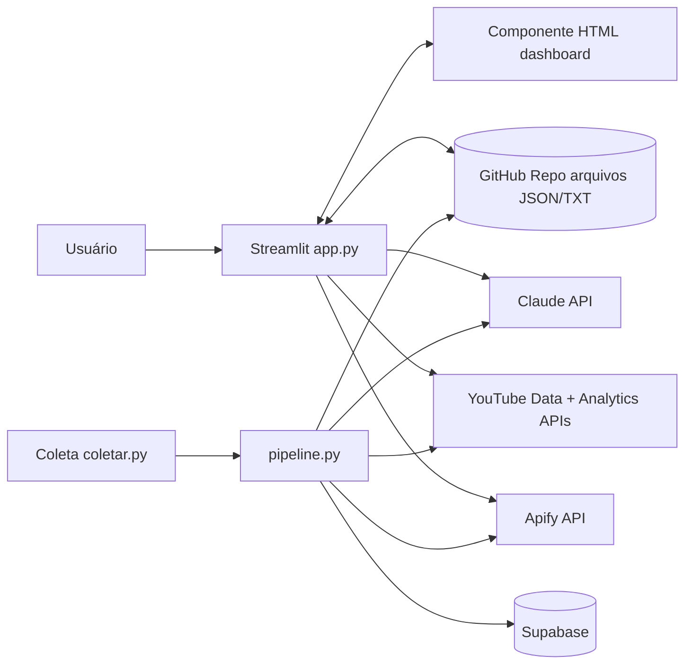
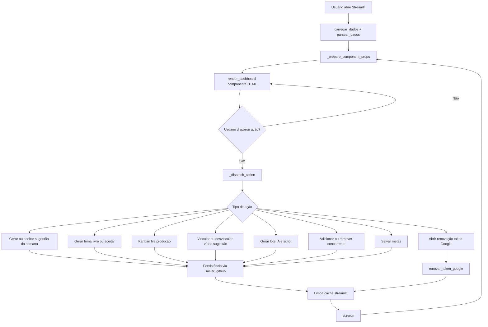
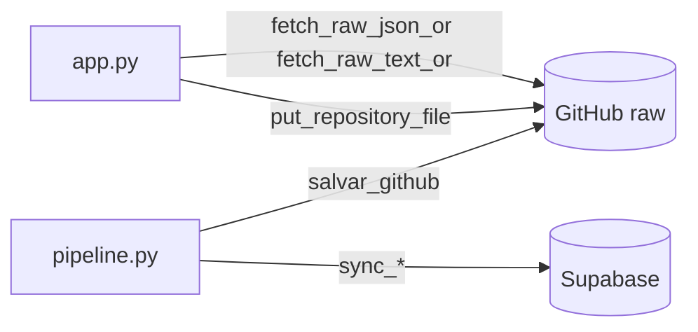

# Fluxo da aplicação (Mermaid)

Este documento descreve o fluxo atual da aplicação para geração de diagramas Mermaid.

## 1) Arquitetura geral

## 2) Fluxo da coleta diária (`coletar.py` -> `collector/pipeline.py`)

```mermaid
flowchart TD
    A[Início da coleta] --> B[Autentica Google OAuth]
    B --> C[Cria clientes YouTube Data e Analytics]
    C --> D[Obtém cotação USD BRL]
    D --> E[Obtém channel_id]

    E --> F[Sync catálogo completo de vídeos no Supabase]
    F --> G[Coleta dados do canal e receita por vídeo]
    G --> H[Salva dados.txt no GitHub]
    H --> I[Atualiza metas receita_q2 no GitHub + Supabase]

    I --> J[Coleta transcrições próprias]
    J --> K[Salva transcricoes_canal.json + sync Supabase]

    K --> L[Atualiza histórico automático]
    L --> M[Vincula sugestões com vídeos reais]
    M --> N[Salva historico.json e sugestoes_pendentes.json]
    N --> O[Sync vídeos métricas sugestões vínculos no Supabase]

    O --> P[Classifica funil editorial]
    P --> Q[Salva funil.json]

    Q --> R[Gera contexto automático]
    R --> S[Anexa aprendizados do criador]
    S --> T[Salva contexto.txt]

    T --> U[Limpa sugestões pendentes antigas]
    U --> V[Coleta e atualiza concorrentes]
    V --> W[Sync concorrentes no Supabase]
    W --> X[Fim da coleta]
```

## 3) Fluxo do dashboard (`app.py`)

## 4) Fluxo de persistência de dados

## 5) Arquivos de dados principais

- `dados.txt`: snapshot textual dos dados do canal e analytics.
- `historico.json`: resultados reais por vídeo.
- `funil.json`: classificação topo/meio/fundo e lacuna.
- `sugestoes_pendentes.json`: sugestões IA ainda não finalizadas.
- `fila_producao.json`: backlog/kanban editorial.
- `concorrentes.json`: base de benchmark e análises.
- `transcricoes_canal.json`: transcrições dos vídeos próprios.
- `metas.json`: metas e valores atuais agregados.
- `contexto.txt`: contexto editorial consolidado para IA.
- `aprendizados_criador.json`: notas e aprendizados manuais.
